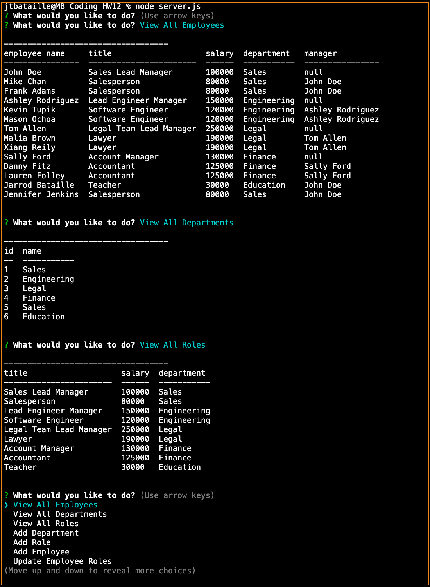
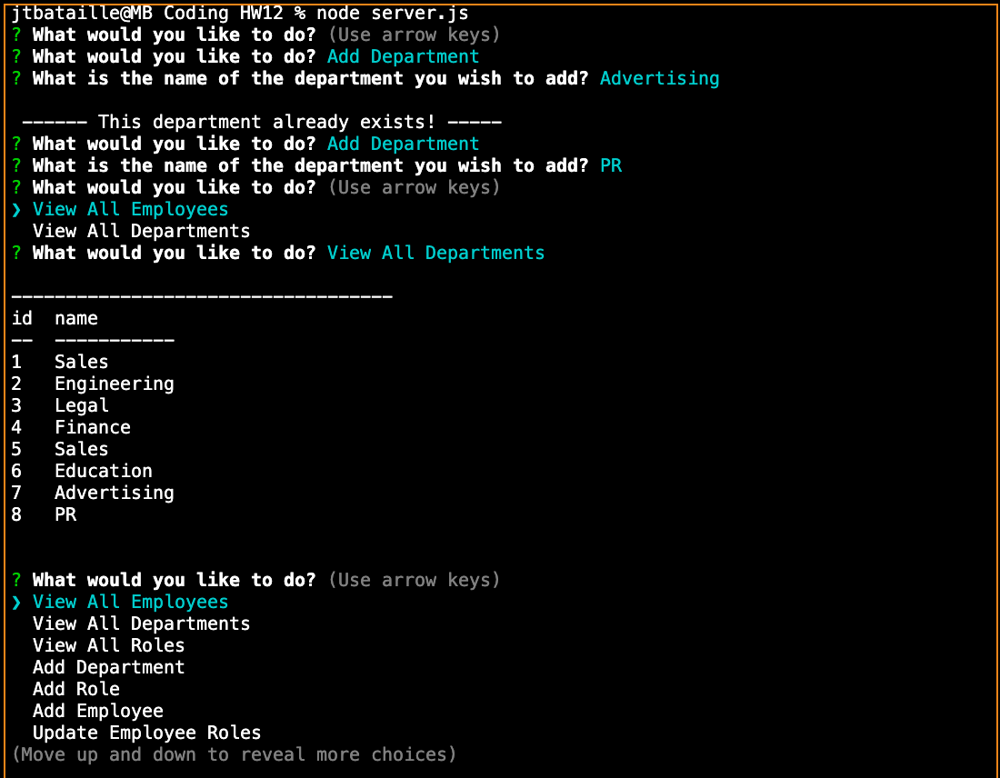
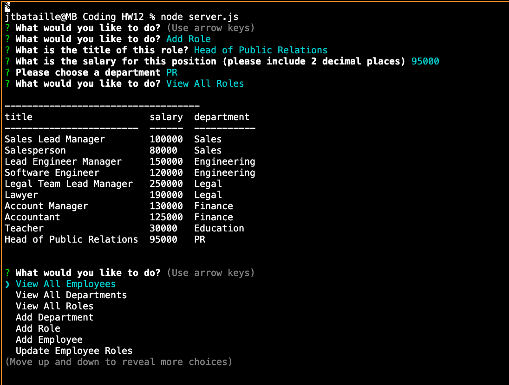
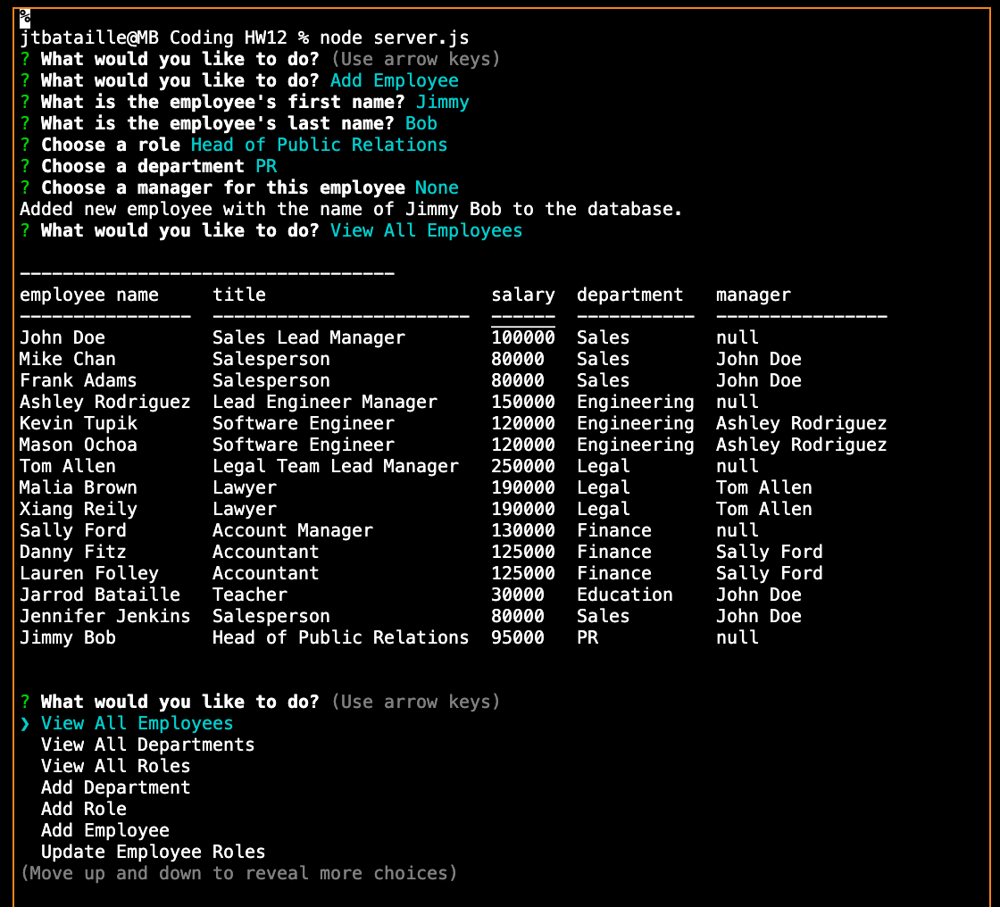
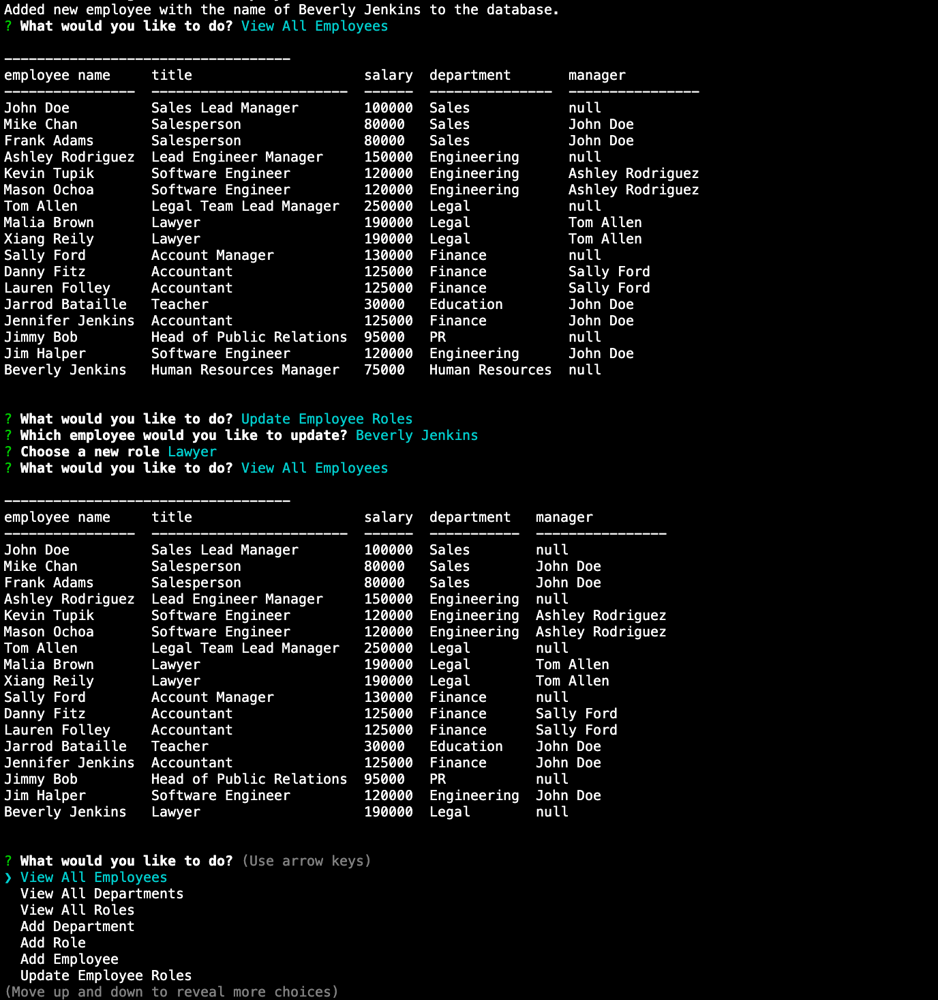

# Employee Tracker Application
[](https://www.gnu.org/licenses/gpl-3.0)

## Table of Contents
* [Description](#description)
* [Installation](#installation)
* [Technologies Used](#technologies-used)
* [Application Demo](#application-demo)
* [Contact Information](#contact-information)

## Description
This is a CLI-based application using a MySQL Database entitled "EmployeeTracker", Inquirer, and Console.Table to allow users to query, view, insert, and modify data within the EmployeeTracker database housed inside of MySQL. This application, however, can be suit itself to the database of users by modifying the connection information housed within the ```server.js``` file.

users is able to use the following command in an integrated terminal to run the application:

<code>node server.js</code>

This command will then query users with various options related to the database, such as "View All Employees," "Add New Employee," "Update Employee Role," etc. The information will be provided to users in a table-form using ```console.table```.

Finally, users can end the connection by selecting "Exit" from the list of options within the CLI.

## Installation
To install, users may clone this GitHub Repository. Upon opening the repository in a coding application, users to use <code>npm i</code> to install the necessary packages for this application (namely, ```inquirer```, ```mysql```, and ```console.table```).

With these packages installed, users can use the ```schema.sql``` file for beginning the database, which houses the database's structure--that which is used by the ***Employee Tracker Application***. The database currently contains information for: department (ID and Name), role (ID, Title, Salary, and the Department ID), and employee (ID, First Name, Last Name, his/her Role ID, and his/her Manager's ID).

In the ```seed.sql``` file, users will find preliminary data which can be inserted into the database as a starting point. This data may be easily modified to fit users's purposes, provided it falls inn line with the underlying structure of the database itself.

With these structures in place, users may use the following command to begin the application:

<code>node server.js</code>

## Technologies Used
Inquirer, MySQL, Console.Table, Node JS

## Application Demo
After opening an integrated terminal and entering the command to begin the CLI, as explained above, users will be greated with a list of options relating to the various functions of the application:

* ```View All Employees```
* ```View All Departments```
* ```View All Roles```
* ```Add Department```
* ```Add Role```
* ```Add Employee```
* ```Update Employee Roles```

The first three options allow users to see each employee, department, and role contained within the database's memory:



The ```Add Department``` option will allow users to add a department to the database, giving it an ID number as well so that it can be used in other areas of the application:



The ```Add Roll``` option will allow users to add a roll to the database, also receiving a new ID to allow it to be continually used. This new roll will also ask for a department to be attached to it from the pre-existing choices in the databse:



The ```Add Employee``` option will allow users to create a new employee. This prompt contains the information for the new employee's first and last name, role, department, and manager (if applicable). This option will then connect the employee's information to the role and department tables within the database:



Finally, the ```Update Employee Roles``` option will allow users to modify the current role of a pre-existing employee. This prompt will provide users with a list of every current employee, from which they can select the desired employee. After this, users will see a list of all current roles within the company, allowing them to select the new role of the desired employee:



## Contact Information
* Jarrod Bataille
  * Portfolio Webpage: https://jtbataille.github.io/
  * GitHub Profile: https://github.com/jtbataille
  * E-mail Address: jtbataille@gmail.com

- - -
Copyright © 2007 Free Software Foundation, Inc. <https://fsf.org/>
